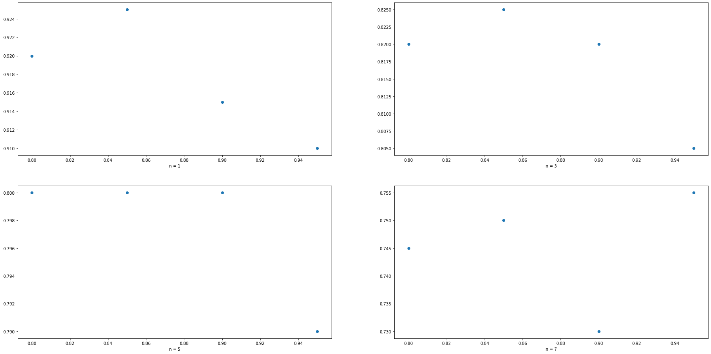
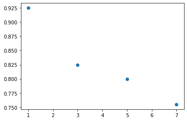

# Face Recognition

We intend to perform face recognition. Face recognition means that for a given
image you can tell the subject id. Our database of subject is very simple. It has 40
subjects.

## Authors

| Name           | ID   |
| -------------- | ---- |
| Fatema Moharam | 6655 |
| Aya Naga       | xxxx |
| Mariam Bardesy | xxxx |

## Dataset

[Database of faces | Kaggle](https://www.kaggle.com/kasikrit/att-database-of-faces)

The dataset has 10 images per 40 subjects. Every image is a grayscale
image of size 92x112.

### Steps

1. Dataset is downloaded to drive using kaggle API. Then, It is unzipped.

```bash
kaggle datasets download -d kasikrit/att-database-of-faces -p drive/MyDrive/faces

mkdir drive/MyDrive/faces/images

unzip drive/MyDrive/faces/att-database-of-faces.zip -d drive/MyDrive/faces/images
```

2. The images are flattened, and split 50% for training and testing.

   The data is also split 70% training - 30% testing later.

## PCA

<a href="https://colab.research.google.com/github/moharamfatema/face-recognition-pca/blob/main/faces_pca.ipynb\" target="_parent\"></a>

### PCA Steps

1. Projection matrix is calculated for the training data using the following algorithm:

```python
def get_pca(
    X : np.ndarray,
    alpha = None,
    r = None
) -> tuple:
  '''
  Performs principal component analysis for a data matrix X

  Returns

  P : np.ndarray
    projection matrix

  mean : np.ndarray
    mean vector
  '''

  # solve for eigenvectors/values
  mean = np.mean(X, axis=0,keepdims=True)
  z = X - mean
  w, V = eigh(np.cov(z.T))

  # Rearrange eigenvectors according to eigenvalues in descending order
  indices = np.argsort(w)[::-1]
  w = w[indices]
  V = V[:,indices]

  # if r value(s) are not provided, decide based on alpha
  if r is None:
    # fraction of variance for every component
    variance_explained = [w[i] / w.sum() for i in range(len(w))]
    cumulative_variance_explained = np.cumsum(variance_explained)

    # if one alpha is provided, decide the dimensions accordingly
    if type(alpha) == int:
      info = cumulative_variance_explained >= alpha
      for i,v in enumerate(info):
        if v:
          r = i + 1
          break
    # if a list of alpha values are provied, calculate r for each value
    elif alpha is not None:
      r = []
      for a in alpha:
        info = cumulative_variance_explained >= a
        for i,v in enumerate(info):
          if v:
            r_a = i + 1
            break
        r.append(r_a)

  print(f"at alpha = {alpha}, r = {r}")

  # if only one r value is decided, calculate the corresponding projection matrix
  if type(r) == int:
    P = V[:,:r]
  # if multiple r values, Calculate projection matrix for each r value
  else:
    P = []
    for i in r:
      P.append(V[:,:i])

  return (P, mean)
```

2. Projection matrices are saved for each alpha.

3. Trainig data and test data are projected to r dimensions according to different alpha values.

4. `sklearn`'s KNN classifier is used to classify test data.

5. Accuracy is calculated for each alpha value.


### Classifier tuning

6. The 2 previous steps are repeated for different values of n = `[1,3,5,7]`.



7. To compare classifier n values, maximum accuracy is calculated for each `n`.


