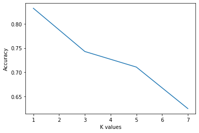

# Face Recognition

We intend to perform face recognition. Face recognition means that for a given
image you can tell the subject id. Our database of subject is very simple. It has 40
subjects.

## Authors

| Name           | ID   |
| -------------- | ---- |
| Fatema Moharam | 6655 |
| Aya Naga       | 6376 |
| Mariam Bardesy | 6200 |

## Dataset

[![kaggle-badge]][ds]

The dataset has 10 images per 40 subjects. Every image is a grayscale
image of size 92x112.

### Steps

1. Dataset is downloaded to drive using kaggle API. Then, It is unzipped.

```bash
kaggle datasets download -d kasikrit/att-database-of-faces -p drive/MyDrive/faces

mkdir drive/MyDrive/faces/images

unzip drive/MyDrive/faces/att-database-of-faces.zip -d drive/MyDrive/faces/images
```

1. The images are flattened, and split 50% for training and testing.

   The data is also split 70% training - 30% testing later.

## PCA

[![colab-badge]][colab-pca]

### PCA Steps

1. Projection matrix is calculated for the training data using the following algorithm:

```python
def get_pca(
    X : np.ndarray,
    alpha = None,
    r = None
) -> tuple:
  '''
  Performs principal component analysis for a data matrix X

  Returns

  P : np.ndarray
    projection matrix

  mean : np.ndarray
    mean vector
  '''

  # solve for eigenvectors/values
  mean = np.mean(X, axis=0,keepdims=True)
  z = X - mean
  w, V = eigh(np.cov(z.T))

  # Rearrange eigenvectors according to eigenvalues in descending order
  indices = np.argsort(w)[::-1]
  w = w[indices]
  V = V[:,indices]

  # if r value(s) are not provided, decide based on alpha
  if r is None:
    # fraction of variance for every component
    variance_explained = [w[i] / w.sum() for i in range(len(w))]
    cumulative_variance_explained = np.cumsum(variance_explained)

    # if one alpha is provided, decide the dimensions accordingly
    if type(alpha) == int:
      info = cumulative_variance_explained >= alpha
      for i,v in enumerate(info):
        if v:
          r = i + 1
          break
    # if a list of alpha values are provied, calculate r for each value
    elif alpha is not None:
      r = []
      for a in alpha:
        info = cumulative_variance_explained >= a
        for i,v in enumerate(info):
          if v:
            r_a = i + 1
            break
        r.append(r_a)

  print(f"at alpha = {alpha}, r = {r}")

  # if only one r value is decided, calculate the corresponding projection matrix
  if type(r) == int:
    P = V[:,:r]
  # if multiple r values, Calculate projection matrix for each r value
  else:
    P = []
    for i in r:
      P.append(V[:,:i])

  return (P, mean)
```

1. Projection matrices are saved for each alpha.

1. Trainig data and test data are projected to r dimensions according to different alpha values.

1. `sklearn`'s KNN classifier is used to classify test data.

1. Accuracy is calculated for each alpha value.

![Accuracy plot][acc-plot]

### Classifier tuning

1. The 2 previous steps are repeated for different values of n = `[1,3,5,7]`.

![Accuracy plot for all n values][acc-n]

1. To compare classifier n values, maximum accuracy is calculated for each `n`.

![Maximum accuracy plot][max-acc]

### 70-30 split

1. [1 - 7] are repeated for 70-30 split.

[![colab-badge]][colab-bonus-pca]

![Accuracy plot for 70-30 split][acc-plot-70]


![Maximum accuracy plot for 70-30 split][max-acc-70]

### Notes

Maximum Accuracy| 50-50 split | 70-30 split
--- | --- | ---
n = 1 | 0.925 | 0.96
n = 3 | 0.825 | 0.93
n = 5 | 0.8   | 0.90
n = 7 | 0.75  | 0.84

Accuracy improves for 70-30 split for all n values.

# faces Vs Non faces
we used datset of flowers with size 834 images we started from 400 to 800 with 100 image as step 

steps:

1-we added new arrays with diff size(500,600,700,800)

2-we loaded the 2 datasets in them and labeled them

3- we repeated the same code for pca again for each data array

questions:

7)a)
i)

iii)


iv)accuracy increases with incrase number of non face images
## LDA

[![colab-badge]][colab-lda]

### LDA Steps

1. Projection matrix is calculated for the training data using the following algorithm:

```python
def LDA():
  numberOfClasses = 40
  numberInEachClass = 5
  index = 0
  Zindex = 0
  sumOfEach = np.zeros((40,10304))
  totalSum = np.zeros((1,10304))
  meanOfEach = np.zeros((40,10304))
  totalMean = np.zeros((1,10304))
  Z = np.zeros((200,10304))
  Sb = np.zeros((10304,10304))
  S = np.zeros((10304,10304))
  U = np.zeros((39,10304))
  w = np.zeros((1,39))

  for i in range(1,numberOfClasses+1):
    # gets the indexes of the label with id=i
    place = np.where(label_train[:] == i)
    #print(place[0])
    # sums the 5 pics values in the same id
    for j in range(numberInEachClass):
      #print(data_train[place[0][j],:])
      sumOfEach[index][:] = sumOfEach[index][:] + data_train[place[0][j],:]
      #print("sum here " + str(sumOfEach))
    # getting the mean of each class
    meanOfEach[index][:] = sumOfEach[index][:] / numberInEachClass
    #print("mean here "+ str(meanOfEach[index][:]))

    # getting the centre class matrices Z
    for k in range(numberInEachClass):
      Z[place[0][k],:] = data_train[place[0][k],:] - meanOfEach[index][:]
    #print("printing Z " + str(Z))
    index += 1

  totalSum = np.sum(sumOfEach, axis=0)
  #print(totalSum.shape)
  # getting the overall sample mean
  totalMean = totalSum / numberOfClasses
  #print(totalMean)

  # getting the between class scatter matrix
  for i in range(numberOfClasses):
    difference = meanOfEach[i] - totalMean
    Sb += (numberInEachClass * np.dot(difference, np.transpose(difference)))

  # getting the within class scatter matrices S
  #for i in range(numberOfClasses):
  S = np.dot(np.transpose(Z),Z)

  w, U = np.linalg.eigh(np.dot(np.linalg.inv(S),Sb))
  sorted_vectors=U[w.argsort()]
  sorted_vectors = np.real(sorted_vectors)
  U=sorted_vectors[-39:]
  print(U.shape)
  return U
```

1. Trainig data and test data are projected to calculated `U`.

1. `sklearn`'s KNN classifier is used to classify test data.

1. The following classification report is calculated:

accuracy for knn: `0.805`

subject|precision|    recall  |f1-score|   support
--- | --- | --- | --- |---
1.0|       1.00|      0.20|      0.33|         5
2.0|       1.00|      1.00|      1.00|         5
3.0|       0.67|      0.80|      0.73|         5
4.0|       0.75|      0.60|      0.67|         5
5.0|       0.62|      1.00|      0.77|         5
6.0|       1.00|      1.00|      1.00|         5
7.0|       1.00|      1.00|      1.00|         5
8.0|       0.83|      1.00|      0.91|         5
9.0|       1.00|      0.40|      0.57|         5
10.0|       1.00|      0.80|      0.89|         5
11.0|       1.00|      1.00|      1.00|         5
12.0|       0.80|      0.80|      0.80|         5
13.0|       0.71|      1.00|      0.83|         5
14.0|       1.00|      1.00|      1.00|         5
15.0|       0.83|      1.00|      0.91|         5
16.0|       0.57|      0.80|      0.67|         5
17.0|       0.62|      1.00|      0.77|         5
18.0|       0.83|      1.00|      0.91|         5
19.0|       0.83|      1.00|      0.91|         5
20.0|       1.00|      0.80|      0.89|         5
21.0|       1.00|      1.00|      1.00|         5
22.0|       1.00|      0.80|      0.89|         5
23.0|       0.80|      0.80|      0.80|         5
24.0|       1.00|      0.80|      0.89|         5
25.0|       1.00|      1.00|      1.00|         5
26.0|       1.00|      0.60|      0.75|         5
27.0|       1.00|      1.00|      1.00|         5
28.0|       1.00|      0.80|      0.89|         5
29.0|       1.00|      1.00|      1.00|         5
30.0|       0.83|      1.00|      0.91|         5
31.0|       0.83|      1.00|      0.91|         5
32.0|       1.00|      1.00|      1.00|         5
33.0|       1.00|      1.00|      1.00|         5
34.0|       0.83|      1.00|      0.91|         5
35.0|       1.00|      0.80|      0.89|         5
36.0|       1.00|      0.40|      0.57|         5
37.0|       1.00|      1.00|      1.00|         5
38.0|       0.71|      1.00|      0.83|         5
39.0|       1.00|      1.00|      1.00|         5
40.0|       0.75|      0.60|      0.67|         5
accuracy    |    -       |     -      |0.87       |200
macro avg   |        0.90|  0.87      |0.86       |200
weighted avg|        0.90|  0.87      |0.86       |200

### LDA classifier tuning

1. Classification is repeated for different values of n = `[1,3,5,7]`.

![Accuracy plot for all n values][acc-n-lda]

### LDA 70-30 split

1. Steps are repeated for 70-30 split.

[![colab-badge]][colab-bonus-lda]

accuracy for knn:`0.8321428571428571`

subject| precision|    recall|  f1-score|   support
--- | --- | --- | --- | ---
1.0|       1.00|      1.00|      1.00|         3
2.0|       0.75|      1.00|      0.86|         3
3.0|       0.75|      1.00|      0.86|         3
4.0|       1.00|      0.67|      0.80|         3
5.0|       0.75|      1.00|      0.86|         3
6.0|       1.00|      1.00|      1.00|         3
7.0|       1.00|      1.00|      1.00|         3
8.0|       1.00|      1.00|      1.00|         3
9.0|       0.75|      1.00|      0.86|         3
10.0|       1.00|      0.67|      0.80|         3
11.0|       1.00|      0.33|      0.50|         3
12.0|       1.00|      1.00|      1.00|         3
13.0|       1.00|      1.00|      1.00|         3
14.0|       1.00|      0.67|      0.80|         3
15.0|       0.75|      1.00|      0.86|         3
16.0|       1.00|      1.00|      1.00|         3
17.0|       1.00|      1.00|      1.00|         3
18.0|       1.00|      0.67|      0.80|         3
19.0|       1.00|      0.67|      0.80|         3
20.0|       0.60|      1.00|      0.75|         3
21.0|       1.00|      1.00|      1.00|         3
22.0|       0.60|      1.00|      0.75|         3
23.0|       1.00|      1.00|      1.00|         3
24.0|       1.00|      1.00|      1.00|         3
25.0|       1.00|      1.00|      1.00|         3
26.0|       1.00|      1.00|      1.00|         3
27.0|       1.00|      1.00|      1.00|         3
28.0|       0.33|      0.33|      0.33|         3
29.0|       1.00|      0.67|      0.80|         3
30.0|       0.75|      1.00|      0.86|         3
31.0|       1.00|      1.00|      1.00|         3
32.0|       1.00|      1.00|      1.00|         3
33.0|       1.00|      1.00|      1.00|         3
34.0|       1.00|      1.00|      1.00|         3
35.0|       1.00|      0.67|      0.80|         3
36.0|       1.00|      1.00|      1.00|         3
37.0|       0.60|      1.00|      0.75|         3
38.0|       1.00|      0.67|      0.80|         3
39.0|       1.00|      0.33|      0.50|         3
40.0|       0.67|      0.67|      0.67|         3
accuracy |             ||             0.88 |      120
macro avg|       0.91|      0.88|      0.87|       120
weighted avg|       0.91|      0.88|      0.87|       120



### Notes on LDA

Accuracy| 50-50 split | 70-30 split
---   | ---   | ---
n = 1 | 0.87  | 0.88
n = 3 | 0.70  | 0.73
n = 5 | 0.65  | **0.70**
n = 7 | 0.60  | 0.63

Accuracy improves *slightly* for 70-30 split for some n values.
# faces Vs Non faces
we used datset of flowers with size 834 images we started from 400 to 800 with 100 image as step 

steps:

1-we added new arrays with diff size(500,600,700,800)

2-we loaded the 2 datasets in them and labeled them

3- we repeated the same code for lda again for each data array

questions:

7)a)
i)

iii)

![Accuracy plot for nonfaces][acc-nonfacel]

iv)accuracy decreases with incrase number of non face images

---

[acc-plot]: img/pca-n%3D1.png
[acc-n]: img/pca-all.png
[max-acc]: img/pca-max.png
[acc-plot-70]: img/pca-b-n=1.png
[max-acc-70]: img/pca-b-max.png
[acc-n-lda]: img/lda.png
[acc-nonface]:img/pca_nonface_accuracy.png
[acc-nonfacel]:img/Lda.png
[ds]: https://www.kaggle.com/kasikrit/att-database-of-faces

[colab-badge]: https://colab.research.google.com/assets/colab-badge.svg

[colab-pca]: https://colab.research.google.com/github/moharamfatema/face-recognition-pca/blob/main/faces_pca.ipynb

[colab-lda]: https://colab.research.google.com/github/moharamfatema/face-recognition-pca/blob/main/faces_lda.ipynb

[colab-bonus-lda]: https://colab.research.google.com/github/moharamfatema/face-recognition-pca/blob/main/faces_bonus_lda.ipynb

[colab-bonus-pca]: https://colab.research.google.com/github/moharamfatema/face-recognition-pca/blob/main/faces_bonus_pca.ipynb

[kaggle-badge]: https://kaggle.com/static/images/open-in-kaggle.svg
