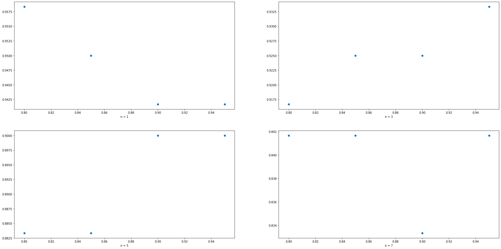

# Face Recognition

We intend to perform face recognition. Face recognition means that for a given
image you can tell the subject id. Our database of subject is very simple. It has 40
subjects.

## Authors

| Name           | ID   |
| -------------- | ---- |
| Fatema Moharam | 6655 |
| Aya Naga       | xxxx |
| Mariam Bardesy | xxxx |

## Dataset

[![kaggle-badge]][ds]

The dataset has 10 images per 40 subjects. Every image is a grayscale
image of size 92x112.

### Steps

1. Dataset is downloaded to drive using kaggle API. Then, It is unzipped.

```bash
kaggle datasets download -d kasikrit/att-database-of-faces -p drive/MyDrive/faces

mkdir drive/MyDrive/faces/images

unzip drive/MyDrive/faces/att-database-of-faces.zip -d drive/MyDrive/faces/images
```

1. The images are flattened, and split 50% for training and testing.

   The data is also split 70% training - 30% testing later.

## PCA

[![colab-badge]][colab-pca]

### PCA Steps

1. Projection matrix is calculated for the training data using the following algorithm:

```python
def get_pca(
    X : np.ndarray,
    alpha = None,
    r = None
) -> tuple:
  '''
  Performs principal component analysis for a data matrix X

  Returns

  P : np.ndarray
    projection matrix

  mean : np.ndarray
    mean vector
  '''

  # solve for eigenvectors/values
  mean = np.mean(X, axis=0,keepdims=True)
  z = X - mean
  w, V = eigh(np.cov(z.T))

  # Rearrange eigenvectors according to eigenvalues in descending order
  indices = np.argsort(w)[::-1]
  w = w[indices]
  V = V[:,indices]

  # if r value(s) are not provided, decide based on alpha
  if r is None:
    # fraction of variance for every component
    variance_explained = [w[i] / w.sum() for i in range(len(w))]
    cumulative_variance_explained = np.cumsum(variance_explained)

    # if one alpha is provided, decide the dimensions accordingly
    if type(alpha) == int:
      info = cumulative_variance_explained >= alpha
      for i,v in enumerate(info):
        if v:
          r = i + 1
          break
    # if a list of alpha values are provied, calculate r for each value
    elif alpha is not None:
      r = []
      for a in alpha:
        info = cumulative_variance_explained >= a
        for i,v in enumerate(info):
          if v:
            r_a = i + 1
            break
        r.append(r_a)

  print(f"at alpha = {alpha}, r = {r}")

  # if only one r value is decided, calculate the corresponding projection matrix
  if type(r) == int:
    P = V[:,:r]
  # if multiple r values, Calculate projection matrix for each r value
  else:
    P = []
    for i in r:
      P.append(V[:,:i])

  return (P, mean)
```

1. Projection matrices are saved for each alpha.

1. Trainig data and test data are projected to r dimensions according to different alpha values.

1. `sklearn`'s KNN classifier is used to classify test data.

1. Accuracy is calculated for each alpha value.

![Accuracy plot][acc-plot]

### Classifier tuning

1. The 2 previous steps are repeated for different values of n = `[1,3,5,7]`.

![Accuracy plot for all n values][acc-n]

1. To compare classifier n values, maximum accuracy is calculated for each `n`.

![Maximum accuracy plot][max-acc]

### 70-30 split

1. [1 - 7] are repeated for 70-30 split.

[![colab-badge]][colab-bonus-pca]

![Accuracy plot for 70-30 split][acc-plot-70]



![Maximum accuracy plot for 70-30 split][max-acc-70]

### Notes

Maximum Accuracy| 50-50 split | 70-30 split
--- | --- | ---
n = 1 | 0.925 | 0.96
n = 3 | 0.825 | 0.93
n = 5 | 0.8   | 0.90
n = 7 | 0.75  | 0.84

Accuracy improves for 70-30 split for all n values.

---

[acc-plot]: img/pca-n%3D1.png
[acc-n]: img/pca-all.png
[max-acc]: img/pca-max.png
[acc-plot-70]: img/pca-b-n=1.png
[max-acc-70]: img/pca-b-max.png

[ds]: https://www.kaggle.com/kasikrit/att-database-of-faces

[colab-badge]: https://colab.research.google.com/assets/colab-badge.svg

[colab-pca]: https://colab.research.google.com/github/moharamfatema/face-recognition-pca/blob/main/faces_pca.ipynb

[colab-bonus-pca]: https://colab.research.google.com/github/moharamfatema/face-recognition-pca/blob/main/faces_bonus_pca.ipynb

[kaggle-badge]: https://kaggle.com/static/images/open-in-kaggle.svg
